# Ankommen & Setup
___
Willkommen zum Workshop „Einführung in R & RStudio" 👋  
An Tag 1 legen wir die Grundlagen, die wir am zweiten Tag weiter vertiefen.

**Ziele für heute**

- RStudio-Oberfläche kennenlernen
- verstehen, wie R „denkt"
- erste eigene Objekte und Daten erzeugen

# Was ist R und RStudio?
___
**R** ist eine freie Programmiersprache, mit der man *Daten analysieren, auswerten und grafisch* darstellen kann.

<u>**Du kannst mit R zum Beispiel:**</u>

- Tabellen mit vielen Zahlen auswerten
- Mittelwerte, Häufigkeiten oder Korrelationen berechnen
- Diagramme und Grafiken erstellen
- Daten aufbereiten, filtern und umformen

**R** wird häufig in den Sozialwissenschaften, der Psychologie, der Medizin und vielen anderen Forschungsbereichen genutzt, unabhängig ob ***quantitativ oder qualitativ*** gearbeitet wird.  
Der große Vorteil von **R** ist, dass alle Analyseschritte transparent, nachvollziehbar und reproduzierbar sind – man kann also genau sehen, wie ein Ergebnis entstanden ist.

**RStudio** ist ***keine eigene Programmiersprache***, sondern ein Programm, das die Arbeit mit R erleichtert.  
Man kann sich **RStudio** wie einen Schreibtisch für *R* vorstellen.

<u>**RStudio hilft dir dabei:**</u>

- Code übersichtlich zu schreiben
- Befehle auszuführen und Ergebnisse zu sehen
- Daten, Objekte und Grafiken im Blick zu behalten
- Dateien und Projekte organisiert zu verwalten

Ohne ***RStudio*** müsstest du **R** über ein sehr einfaches Fenster bedienen. Mit RStudio bekommst du eine strukturierte Oberfläche, die besonders für Einsteiger:innen viel angenehmer ist.

## R GUI – erste Ansicht

Schauen wir uns zunächst die **R-Oberfläche** ***(ohne RStudio)*** an.

::: columns
::: column
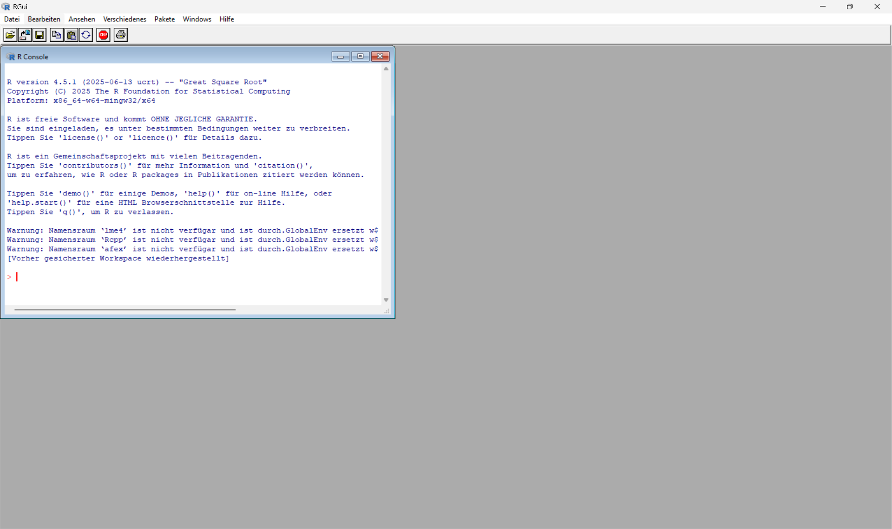{height=250 style="border: 2px solid red;"}
:::

::: column
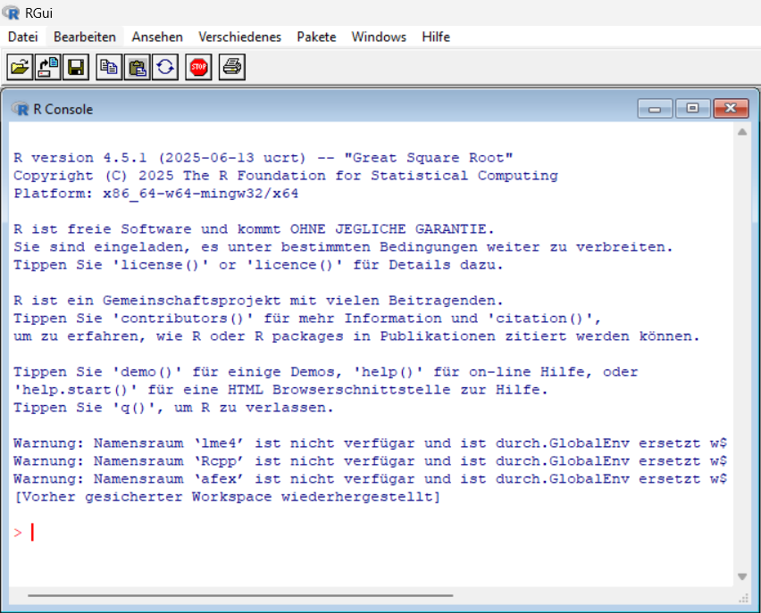{height=250 style="border: 2px solid red;"}
:::
:::

**Was sehen wir hier?**

- ***Linkes Bild***
  - Die „normale" **R-Oberfläche**
    - Sie besteht zunächst nur aus einer ***R Console***
- ***Rechtes Bild***
  - Die **R Console**
    - Hier werden Befehle direkt eingegeben
    - Ergebnisse erscheinen sofort darunter

::: callout-note
# **Hinweis**

Alles, was du in die Konsole eingibst, wird sofort von R ausgeführt. Das Ergebnis siehst du direkt unter der eingegebenen Zeile.

***Beispiel***

- gib `13` ein
- gib `a` ein
- gib `13 + 15` ein
:::

::: callout-caution
**ABER**

Wir brauchen ***R GUI*** nicht, sondern nutzen **RStudio!**
:::

## RStudio – Unser Cockpit 🎛️

Schauen wir uns nun die Oberfläche von **RStudio** an. Startet einfach **RStudio** ***(nicht R GUI!)***. Ihr solltet nun das folgende Bild sehen:

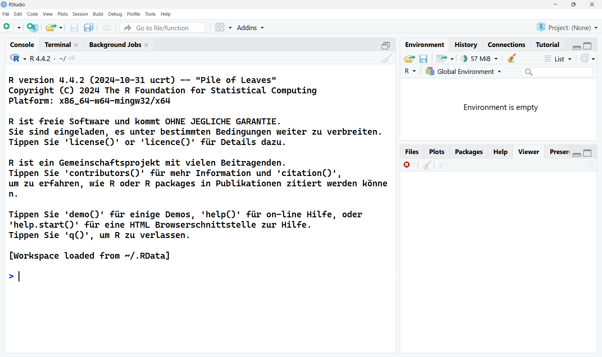{width=100% style="border: 2px solid darkblue;"}

**Wir schauen uns nun die Menü-Leiste von RStudio an:**

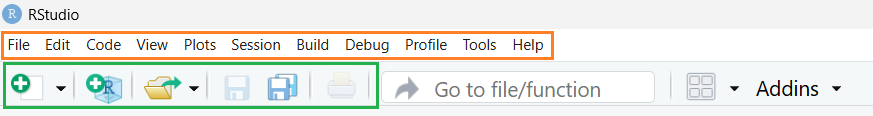{width=100% style="border: 2px solid darkblue;"}

<span style="color: orange; font-weight: bold;">Orange</span> – die Menü-Leiste

In der Menü-Leiste findest du alle wichtigen Funktionen von RStudio übersichtlich nach Themen sortiert. Hier kannst du zum Beispiel Dateien öffnen und speichern, Einstellungen ändern, Code ausführen oder Hilfe aufrufen. *Das Aussehen deines RStudios kannst du auch hier anpassen!*

<span style="color: green; font-weight: bold;">Grün</span> – die Schnellzugriff-Leiste

Die Schnellzugriff-Leiste enthält häufig genutzte Funktionen als Symbole. Damit kannst du z. B. schnell neue Dateien erstellen, Skripte speichern oder Code ausführen, ohne durch Menüs zu klicken.

## Die vier Bereiche von RStudio

RStudio ist in **vier Arbeitsbereiche** (Panes/Paneele) aufgeteilt. Jeder Bereich hat eine eigene Aufgabe. Im ersten Moment siehst du jedoch nur drei Bereiche – ich zeige dir, wie du den vierten bekommst.

::: callout-note
Hierfür gehst du in die **Schnellzugriffs-Leiste** und klickst auf das Symbol ganz links, das **weiße Blatt** mit dem <span style="color: green; font-weight: bold;">**Plus**</span>.

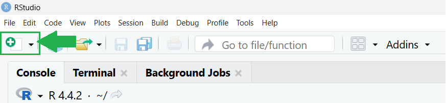{width=100% style="border: 2px solid darkblue;"}

Anschließend öffnet sich ein **Dropdown-Menü** – hier siehst du bereits, was du alles mit ***RStudio*** machen kannst.

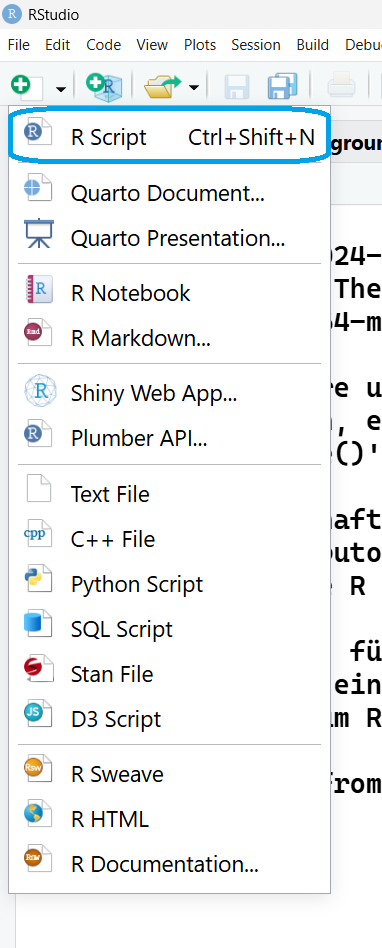{height=600 style="border: 2px solid darkblue;"}

Wir wollen ein neues **R Script erstellen**, daher klicken wir auf diesen Eintrag.

::: callout-note
# Info
Diese Workshopseite wurde übrigens komplett mit RStudio und Quarto Markdown erstellt.
:::
:::

Jetzt sollte dein RStudio so aussehen:

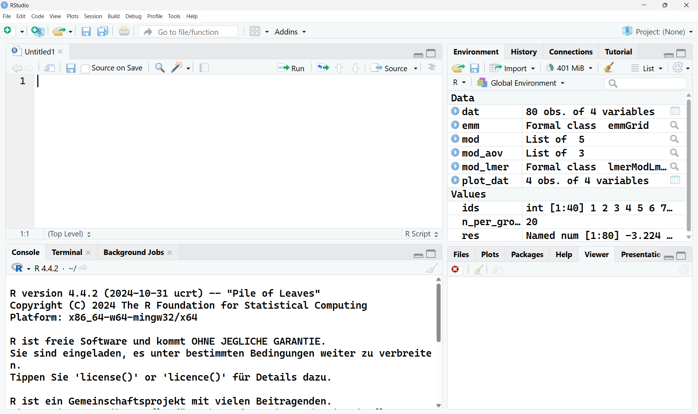{width=100% style="border: 2px solid darkblue;"}

### 🔵 Skript-Editor (oben links)
___
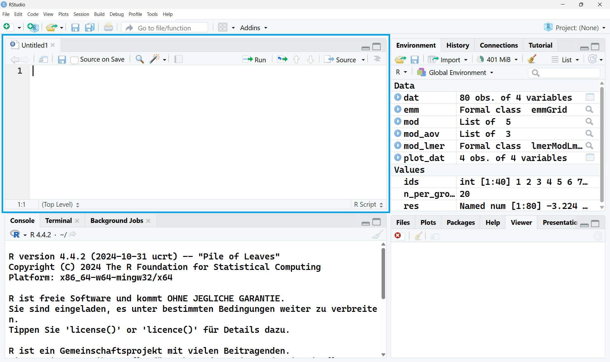{width=100% style="border: 2px solid darkblue;"}

Hier schreibst du deinen **Code** in Skripten.

- Code wird **nicht sofort** ausgeführt
- du kannst ihn speichern, verändern und wiederverwenden
- ideal für sauberes, nachvollziehbares Arbeiten

::: callout-note
👉 **Merke:**  
Alles Wichtige gehört ins **Skript**, nicht nur in die Konsole.
:::


### ⚫ Konsole (unten links)
___
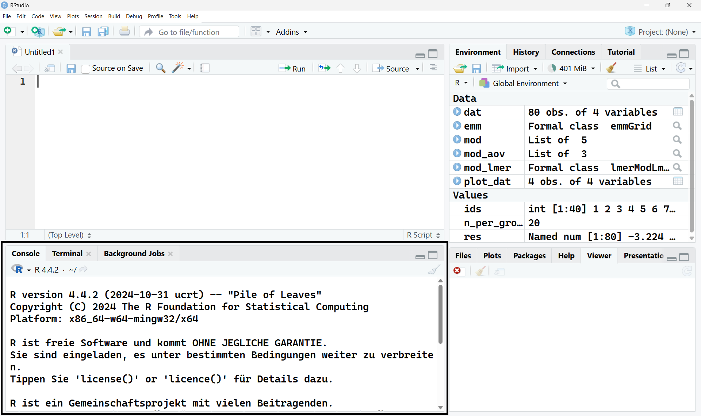{width=100% style="border: 2px solid darkblue;"}

Die ***Konsole*** kennen wir im Grunde schon – es ist dieselbe Konsole wie bei **R GUI**.

- hier führt R Befehle aus
- Ergebnisse erscheinen direkt darunter
- gut zum Ausprobieren und Testen

👉 Code aus dem Skript kann mit **Run** oder **Strg + Enter** ausgeführt werden.


### 🟣 Environment & History (oben rechts)
___
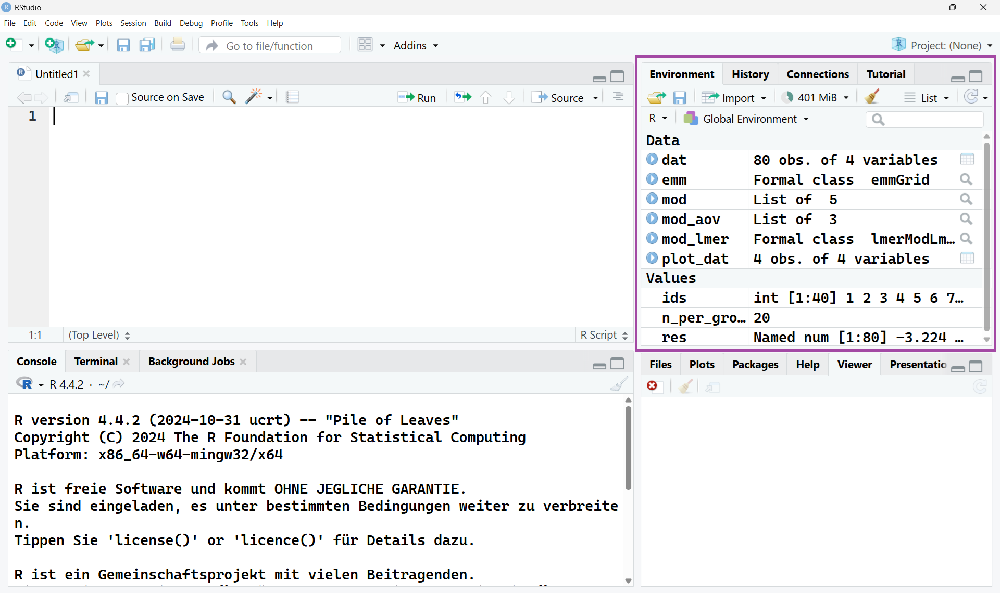{width=100% style="border: 2px solid darkblue;"}

<u>Im **Environment** siehst du:</u>

- alle Objekte, die du erstellt hast
- z. B. Variablen, Daten, Ergebnisse

<u>In der **History** findest du:</u>

- frühere Befehle, die du eingegeben hast

👉 So behältst du den Überblick, was gerade „im Speicher" liegt.


### 🟢 Files, Plots, Packages, Help (unten rechts)
___
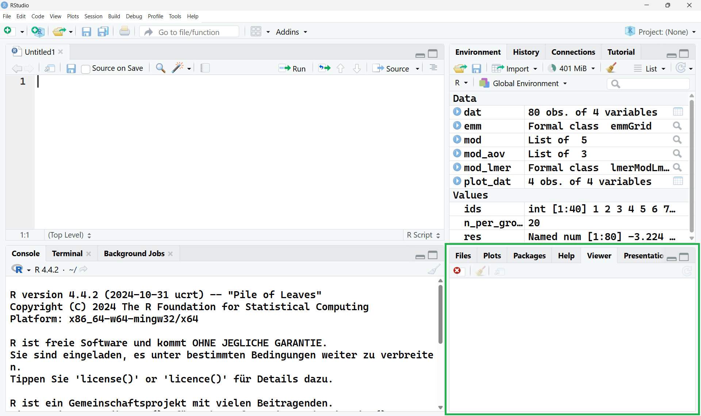{width=100% style="border: 2px solid darkblue;"}

Dieser Bereich zeigt dir:

- **Files**: deine Dateien und Ordner
- **Plots**: Grafiken, die du erzeugst
- **Packages**: installierte Erweiterungen
- **Help**: Hilfeseiten zu Funktionen

👉 Hier findest du fast alles, was R zusätzlich ausgibt – und wo es gespeichert ist.

::: callout-important
Im nächsten Abschnitt legen wir unser erstes **Projekt** an!
:::

# Projekt anlegen
___
Ein Projekt hilft dir, **strukturiert und reproduzierbar** zu arbeiten.

- alle Dateien (Skripte, Daten, Grafiken) liegen an einem festen Ort  
- R weiß immer, **wo es die Dateien findet** (keine kaputten Pfade)
- du kannst deine Arbeit jederzeit schließen und **genau dort weitermachen**
- besonders wichtig für größere Analysen und gemeinsames Arbeiten

👉 **Merke:**  
Ein neues Projekt = ein neuer, sauberer Arbeitskontext.
 
::: callout-warning
**Typischer Anfängerfehler**

Viele arbeiten **ohne Projekt** und laden Dateien „irgendwoher".

Das führt oft zu:

- Fehlermeldungen wie *„file not found"*
- nicht reproduzierbaren Analysen
- Verwirrung, wenn man die Sitzung neu startet

👉 **Gewöhne dir an:**  
Für **jedes Projekt** ein eigenes RStudio-Projekt anzulegen.
:::

### Projekt anlegen – Schritt für Schritt
___
1. Klicke oben auf **File → New Project…** in der Menü-Leiste
2. Wähle **New Directory**
3. Wähle **New Project**
4. Vergib einen **sinnvollen Namen** (z. B. `r_workshop_tag1`)
5. Wähle einen Speicherort auf deinem Rechner
6. Klicke auf **Create Project**

::: columns
::: column
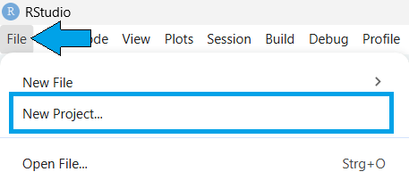{width=100% style="border: 2px solid darkblue;"}
**Schritt 1:**  
*File → New Project…*
:::

::: column
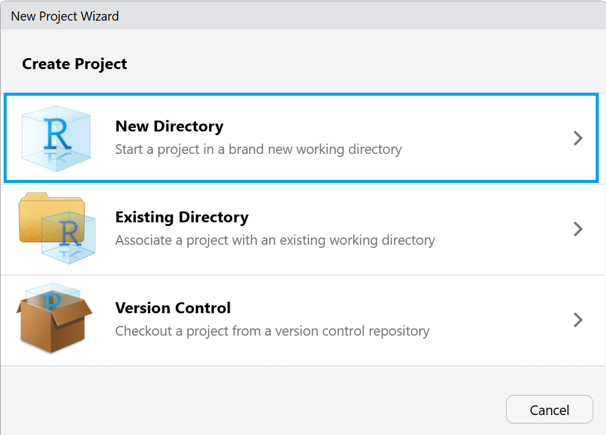{width=100% style="border: 2px solid darkblue;"}
**Schritt 2:**  
*New Directory*
:::
:::

::: columns
::: column
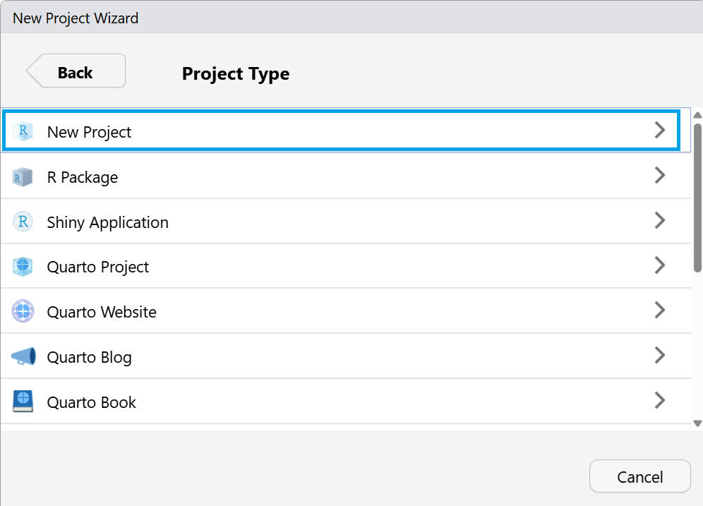{width=100% style="border: 2px solid darkblue;"}
**Schritt 3:**  
*New Project*
:::

::: column
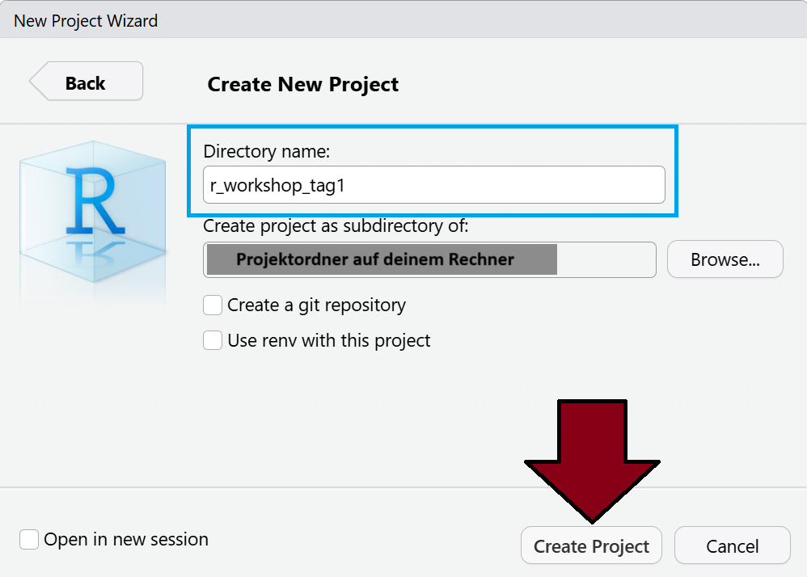{width=100% style="border: 2px solid darkblue;"}
**Schritt 4 bis 6:**  
*Name vergeben, Speicherort wählen & Create Project*
:::
:::


::: callout-tip
👉 **Tipp:**  
Der Projektname sollte **keine Leerzeichen** enthalten  
(z. B. `r_workshop_tag1` statt `R Workshop Tag 1`)
:::

**RStudio startet nun neu – du arbeitest jetzt** ***innerhalb deines Projekts.***


# R Script
___
Nachdem wir ein Projekt angelegt haben, beginnen wir mit dem eigentlichen Arbeiten in einem **R Script**.

Ein Script ist eine Textdatei, in der du deine Befehle sammelst und speicherst.  
So kannst du:

- deine Arbeit nachvollziehen
- Code später wiederverwenden
- Analysen Schritt für Schritt dokumentieren

RStudio bietet viele Möglichkeiten, mit R zu arbeiten.  
Wir starten bewusst **sehr einfach**, um ein Gefühl dafür zu bekommen, wie R reagiert.

::: callout-tip
### **Erinnerung**
Mit **Strg + Enter** wird der Befehl **in der Zeile ausgeführt, in der dein Cursor steht** –  
du musst den Code **nicht markieren** und **nicht auf „Run" klicken**.
:::


## RStudio als Taschenrechner

Zum Einstieg kannst du RStudio wie einen **Taschenrechner** benutzen.

Du gibst einen Befehl ein – R rechnet – und gibt das Ergebnis zurück.  
So lernst du schnell:

- wie Befehle aufgebaut sind
- wie R mit Zahlen umgeht
- dass R immer auf **Eingaben reagiert**

```{r}
#| echo: true

2 + 2
10 / 3
sqrt(49)
```

::: {.callout-warning collapse="true"}
# **Warum ins Skript schreiben?**

Befehle, die du **nur in der Konsole** eingibst, sind schnell wieder weg –  
du musst später mühsam hochscrollen, um sie zu finden.

Schreibst du deine Rechnungen **in ein R Script**, bleiben sie erhalten:

- du kannst sie jederzeit wieder ausführen
- du behältst den Überblick
- deine Arbeit ist nachvollziehbar und reproduzierbar
:::

## Übung

1. Berechne den Ausdruck `((8 + 4)^2 - 10) / 2`.
2. Berechne anschließend `sqrt(196) + 3^3`.
3. Führe **alle Rechnungen**
   - einmal direkt in der **Konsole**
   - und einmal aus einem **Skript**

Beobachte, was gleich ist und was sich unterscheidet.

::: {.callout-tip collapse="true"}
# **Lösung**

```{r}
#| echo: true

# Aufgabe 1
((8 + 4)^2 - 10) / 2

# Aufgabe 2
sqrt(196) + 3^3
```
::: 

# Grundprinzipien von R
___
R arbeitet objektorientiert: Alles, was du erzeugst, kann ein Objekt sein und bekommt einen Namen.

```{r}
#| echo: true

x <- 5
y <- c(23, 12, 11, 9, 13)
```

::: callout-note
# **Hinweis**

- `<-` ist der **Zuweisungspfeil**: Er weist den Wert rechts dem Namen links zu.  
- `c()` steht für **combine**: Damit fasst R mehrere Werte zu einem **Vektor** zusammen.  
- `y` ist der **Name des Objekts**. Das Objekt selbst ist ein **Vektor**, der mehrere Zahlen enthält.
:::

## Funktionen verwenden

Funktionen sind **vordefinierte Befehle**, mit denen R etwas für uns erledigt.  
Sie nehmen einen oder mehrere **Eingabewerte** entgegen, führen damit eine bestimmte Operation aus und geben ein **Ergebnis** zurück.

Man kann sich Funktionen wie **Werkzeuge** vorstellen:  
Je nach Aufgabe benutzen wir ein anderes Werkzeug.

In R werden Funktionen immer mit **runden Klammern `()`** aufgerufen.

Im Folgenden verwenden wir einige **grundlegende Funktionen**, die R bereits mitbringt:

```{r}
#| echo: true

sum(y)
mean(y)
sd(y)
median(y)
mad(y)
min(y)
max(y)
range(y)
length(y)
```

::: {.callout-note collapse="true"}
# **Was machen diese Funktionen?**

- `sum()` – berechnet die **Summe** aller Werte  
- `mean()` – berechnet den **Mittelwert**  
- `sd()` – berechnet die **Standardabweichung**  
- `median()` – gibt den **Median** zurück  
- `mad()` – berechnet die **mittlere absolute Abweichung**  
- `range()` – gibt **kleinsten und größten Wert** aus  
- `min()` – kleinster Wert  
- `max()` – größter Wert  
- `length()` – Anzahl der Werte

Es gibt eine Vielzahl **Base R-Funktionen** – erkunde sie gerne!
:::

Funktionen können nicht nur einzeln, sondern auch **miteinander kombiniert** werden.  
Das Ergebnis einer Funktion kann dabei **direkt als Eingabe** für eine andere dienen.

```{r}
#| echo: true

sqrt(mean(y))
max(y) - min(y)
```

In der nächsten Übung nutzen wir diese Grundfunktionen,  
um eigene Kennwerte zu berechnen und die Ergebnisse **als Objekte zu speichern**.

## Übung

Nutze den Vektor `y` und berechne folgende Kennwerte:

1. Den **Standardfehler des Mittelwerts**  
2. Die **Varianz**  
3. Die **z-standardisierten Werte** (z-Werte)  
4. Das **95%-Konfidenzintervall** (KI) für den Mittelwert

Speichere alle Ergebnisse als eigene Objekte, z. B.: `se_y`, `var_y`, `z_y`, `ci_y`.


::: {.callout-tip collapse="true"}
# **Tipp: Formeln für die Berechnung**

Du darfst dir für die Berechnung **Hilfsobjekte** anlegen.

:::{.panel-tabset}

# **Standardfehler des Mittelwerts**

$$
SE = \frac{sd(x)}{\sqrt{n}}
$$

- $sd$ = Standardabweichung 
- $n$ = Anzahl der Werte  

# **Varianz (Stichprobe)**

$$
\text{Var} = \frac{1}{n - 1} \sum (x - \bar{x})^2
$$

- $\bar{x}$ = Mittelwert der Daten  
- $\sum$ = Summe über alle Beobachtungen  

# **z-Standardisierung**

$$
z = \frac{x - \bar{x}}{sd(x)}
$$

# **95%-Konfidenzintervall des Mittelwerts**

$$
\bar{x} \pm t_{0.975,\,n-1} \cdot SE
$$

- $t_{0.975,\,n-1}$ = kritischer t-Wert für ein **95 %-Konfidenzintervall**. In R: `qt(0.975, df = n - 1)`
- $\pm$ = untere und obere Grenze des Intervalls
:::
:::

::: {.callout-tip collapse="true"}
# **Lösung**

:::{.panel-tabset}
# Hilfsobjekte
```{r}
#| echo: true

n <- length(y)   # Anzahl der Werte
m <- mean(y)     # Mittelwert
s <- sd(y)       # Standardabweichung
```
# 1. Standardfehler
```{r}
#| echo: true
se_y <- s / sqrt(n)
se_y
```
# 2. Varianz
```{r}
#| echo: true
var_y <- sum((y - m)^2) / (n - 1)
var_y
```
# 3. z-Werte
```{r}
#| echo: true
z_y <- (y - m) / s
z_y
```
# 4. Konfidenzintervall
```{r}
#| echo: true
t_crit <- qt(0.975, df = n - 1)

ci_y <- c(
  lower = m - t_crit * se_y,
  upper = m + t_crit * se_y
)

ci_y
```
:::
:::


::: callout-warning
# **Häufige Fehler**

- Funktion falsch geschrieben: `Mean(y)` statt `mean(y)`  
- Klammern vergessen: `mean y` statt `mean(y)`  
- `<-` vergessen oder `=` inkonsistent verwendet  
- Im falschen Fenster tippen (Konsole statt Skript oder umgekehrt)
:::

## Datentypen & Datenstrukturen

In R ist es wichtig zu wissen, **was für eine Art von Daten** wir vor uns haben  
und **wie diese Daten organisiert sind**.

Deshalb unterscheiden wir zwischen **Datentypen** und **Datenstrukturen**.

Beides bestimmt, wie wir mit Daten rechnen, sie verändern und analysieren können.

### Wichtige Datentypen
___
Datentypen legen fest, **welche Art von Werten** in einem Objekt gespeichert ist.  
R behandelt Zahlen, Text und logische Werte unterschiedlich – je nach Datentyp.

Der Datentyp ist wichtig, weil er bestimmt,

- welche Berechnungen möglich sind
- wie R die Werte interpretiert
- welche Funktionen sinnvoll angewendet werden können

::: callout-note
# **Datentypen im Überblick**

- `numeric` / `double`  
  Zahlen mit Dezimalstellen, z. B. `3.14` oder `-7.5`.  
  Wird für die meisten Berechnungen verwendet.

- `integer`  
  Ganze Zahlen ohne Dezimalstellen, z. B. `1L` oder `42L`.  
  Kommt seltener vor, ist aber wichtig bei Zählvariablen.

- `character`  
  Textwerte, z. B. `"Anna"` oder `"Deutschland"`.  
  Mit Text kann man **nicht rechnen**.

- `logical`  
  Logische Werte: `TRUE` oder `FALSE`.  
  Wird häufig bei Bedingungen oder Filtern genutzt.

- `factor`  
  Kategorische Daten mit festen Ausprägungen, z. B. Geschlecht oder Schulabschluss.
:::


### Wichtige Datenstrukturen
___
Datenstrukturen beschreiben, **wie mehrere Werte in R zusammengefasst und organisiert** sind.  
Sie legen fest, ob Daten einzeln, als einfache Reihe oder als Tabelle gespeichert werden.

::: callout-note
# **Datenstrukturen im Überblick**

- **Vektor**  
  Eine geordnete Sammlung von Werten **gleichen Datentyps**.  
  Grundlage für fast alle anderen Datenstrukturen in R.

- **Matrix**  
  Eine rechteckige Tabelle aus Werten **gleichen Datentyps** (meist Zahlen).  
  Wird vor allem für mathematische und statistische Berechnungen verwendet.

- **Data Frame / tibble**  
  Eine Tabelle mit Zeilen (**Fälle**) und Spalten (**Variablen**).  
  Standardformat für Datensätze in der empirischen Forschung.
:::

Datenstrukturen in R bauen konzeptionell aufeinander auf. Am Anfang steht der **Vektor**:  

- Ein Vektor ist eine einfache, geordnete Reihe von Werten gleichen Datentyps.

Aus Vektoren lassen sich **Matrizen** bilden:

- Eine Matrix ist eine Sammlung mehrerer gleich langer Vektoren, die rechteckig angeordnet sind.

Ein **Data Frame** geht einen Schritt weiter:

- Auch hier bestehen die Spalten aus Vektoren – die Spalten dürfen aber **unterschiedliche Datentypen** haben.

So lassen sich reale Datensätze mit **Zahlen, Text und Kategorien** in einer Tabelle abbilden.

::: callout-warning
# **Wichtig**

Die Datenstrukturen bauen **konzeptionell** aufeinander auf,  
werden in der Praxis aber **nicht automatisch ineinander umgewandelt**.
:::

### Welchen Datentyp oder welche Datenstruktur hat mein Objekt?
___
In R können wir jederzeit überprüfen, **was für eine Art von Objekt** wir im Environment haben. Das ist besonders hilfreich, wenn wir mit vielen Objekten arbeiten oder unsicher sind, wie R ein Objekt interpretiert.

::: callout-tip
# **Grundlegende Befehle im Überblick**

- `class(x)` – gibt eine **allgemeine Einordnung** des Objekts zurück
  - `typeof(x)` – detaillierter als `class()`, zeigt **wie R das Objekt intern speichert**
- `str(x)` – gibt einen **Überblick über Aufbau und Inhalt** eines Objekts

Für **Funktionen**:
- `?mean` – öffnet die **Hilfeseite** zur Funktion `mean()` (Beschreibung, Argumente, Beispiele)
:::

Im Folgenden betrachten wir unsere zuvor erstellten Objekte `x` und `y` genauer:

```{r}
#| echo: true

class(x)
class(y)

typeof(x)
typeof(y)

str(x)
str(y)
```


## Übung

Im bisherigen Verlauf haben wir mehrere **Objekte und Hilfsobjekte** erstellt.

1. Überprüfe für jedes dieser Objekte den **Datentyp** und die **Datenstruktur**.
2. Nutze dafür die Befehle `class()`, `typeof()` und `str()`.
3. Überlege:
   - Welche Objekte sind **einzelne Werte**?  
   - Welche Objekte sind **Vektoren**?

::: {.callout-tip collapse="true"}
# **Lösung**

:::{.panel-tabset}

# Mittelwert
```{r}
#| echo: true
class(m)
typeof(m)
str(m)
```

# Anzahl der Werte
```{r}
#| echo: true
class(n)
typeof(n)
str(n)
```
# Standardabweichung
```{r}
#| echo: true
class(s)
typeof(s)
str(s)
```
# Standardfehler
```{r}
#| echo: true
class(se_y)
typeof(se_y)
str(se_y)
```
# Varianz
```{r}
#| echo: true
class(var_y)
typeof(var_y)
str(var_y)
```
# z-Werte
```{r}
#| echo: true
class(z_y)
typeof(z_y)
str(z_y)
```
# Konfidenzintervall
```{r}
#| echo: true
class(ci_y)
typeof(ci_y)
str(ci_y)
```
:::
:::

::: callout-tip
# **Faustregel: Ein Objekt in R verstehen**
1. `class()` → Welche **Art von Objekt** ist es?
2. `typeof()` → Wie wird das Objekt **intern gespeichert**?
3. `str()` → Wie ist das Objekt **aufgebaut** und welche Inhalte hat es?
:::

## Einen ersten Datensatz in R erstellen

Bisher haben wir mit einzelnen Objekten und Vektoren gearbeitet. In der Praxis bestehen Datensätze jedoch aus **mehreren Variablen**, die gemeinsam eine Gruppe von Fällen beschreiben.

Im nächsten Schritt erstellen wir mehrere Vektoren (z. B. Alter, Geschlecht oder Körpergröße) und führen sie zu einem **kleinen Datensatz** zusammen.

Dabei lernst du,
- wie mehrere Vektoren sinnvoll angelegt werden und  
- wie aus einzelnen Variablen eine tabellarische Struktur entsteht.

Wir legen nun unsere neuen Vektoren (= **Variablen**) an:

```{r}
#| echo: true

# Alter
age <- c(23, 29, 35, 41, 27, 33)

# Geschlecht
gender <- c("female", "male", "female", "male", "female", "male")

# Haarfarbe
hair_color <- c("brown", "blonde", "black", "brown", "red", "black")

# Körpergröße in cm
height_cm <- c(165, 180, 172, 178, 160, 185)

# Gewicht in kg
weight_kg <- c(60, 82, 70, 88, 55, 90)

# Beruf
occupation <- c(
  "student",
  "engineer",
  "teacher",
  "manager",
  "student",
  "researcher"
)
```

Jeder dieser Vektoren stellt eine **Variable** dar.  
Die einzelnen Werte gehören jeweils **zur gleichen Person** – also zur gleichen Zeile im späteren Datensatz.

::: callout-important
# Wichtig 
Alle Vektoren müssen **die gleiche Länge** haben.

Überprüfe das!
:::

Im nächsten Schritt fassen wir die einzelnen Variablen zu einem **gemeinsamen Datensatz** zusammen.  
Dabei verwenden wir zunächst **Base R**, also Funktionen, die ohne zusätzliche Pakete verfügbar sind.

```{r}
#| echo: true

data <- data.frame(
  age        = age,
  gender     = gender,
  hair_color = hair_color,
  height_cm  = height_cm,
  weight_kg  = weight_kg,
  occupation = occupation
)

data
```

::: callout-caution
# Achtung

Aufbau der Funktion `data.frame()`:

`data.frame(name1 = name2)`

- `name1` = Spaltenname im Datensatz
- `name2` = Objektname aus dem Environment
:::

Die einzelnen Vektoren sind nun zu einem **Datensatz** zusammengeführt worden:

- jede **Spalte** ist eine Variable  
- jede **Zeile** ist ein Fall (eine Person)

`data.frame()` ist die klassische Tabellenstruktur in Base R  
und bildet die Grundlage für viele weitere Analyseschritte.

::: callout-note
# **Erinnerung**

Auch ein einzelner Wert ist in R ein **Vektor der Länge 1**. Mit der `c()`-Funktion können wir einzelne Werte zu einem Vektor zusammenfassen.
:::


## Übung

Bisher haben wir einen Datensatz mit sechs Variablen erstellt. Erstelle nun zwei weitere **Variablen** und füge sie zum Datensatz hinzu. Nenne die eine Variable `numbers` und die andere `chars`.

- `numbers` sollen zufällige Zahlen sein, die du dir ausdenkst
- `chars` sollen einfach Namen sein, die dir einfallen

::: {.callout-tip collapse="true"}

# **Lösung**

```{r}
#| echo: true

numbers <- c(12, 5, 17, 6, 75, 22)

chars <- c("Anna", "Alex", "Beate", "Bobby", "Christina", "Chester")

data <- data.frame(
  age        = age,
  gender     = gender,
  hair_color = hair_color,
  height_cm  = height_cm,
  weight_kg  = weight_kg,
  occupation = occupation,
  nmbrs      = numbers,
  chars      = chars
)
```
:::

::: callout-warning
# **Typische Fehler beim Erstellen eines Data Frames**

- **Komma vergessen oder zu viel gesetzt**  
  → führt oft zu unerwarteten Fehlermeldungen

- **Falscher Objektname**  
  → R unterscheidet zwischen Groß- und Kleinschreibung (`Age` ≠ `age`)

- **Unterschiedliche Längen der Vektoren**  
  → alle Variablen müssen **gleich viele Werte** haben
:::

## Exkurs: Pakete

Pakete sind **Erweiterungen von R**.  
Sie enthalten zusätzliche Funktionen, Datensätze und Dokumentationen,  
die bestimmte Aufgaben erleichtern oder überhaupt erst möglich machen.

R bringt bereits viele grundlegende Funktionen mit (Base R).  
Für komplexere oder spezialisierte Aufgaben greifen wir jedoch häufig auf **Pakete** zurück.

### Pakete installieren
___
Bevor wir ein Paket nutzen können, müssen wir es **einmal installieren**.  
Die Installation erfolgt über das Internet und wird lokal auf dem Rechner gespeichert.

```{r}
#| echo: true
#| eval: false

install.packages("tidyverse")
install.packages("psych")
```

::: callout-warning
# **Wichtig**

`install.packages()` muss **nur einmal** ausgeführt werden.  
Danach ist das Paket dauerhaft auf deinem Rechner verfügbar.
:::

### Paket laden
___
Nach der Installation müssen Pakete **in jeder neuen R-Sitzung geladen** werden,
damit ihre Funktionen zur Verfügung stehen.

```{r}
#| echo: true
#| eval: false

library(tidyverse)
library(psych)
```

::: callout-tip
# **Merksatz**

- `install.packages()` → einmal installieren  
- `library()` → in jeder Sitzung laden
:::

### Das `tidyverse`
___
Das **`tidyverse`** ist eine Sammlung mehrerer Pakete,  
die besonders für **Datenaufbereitung, Analyse und Visualisierung** entwickelt wurden.

Es bietet:

- gut lesbaren Code  
- einheitliche Funktionsnamen  
- komfortable Werkzeuge für Data Frames

::: callout-tip
Typische `tidyverse`-Pakete sind zum Beispiel:

- `dplyr` (Datenaufbereitung)
- `ggplot2` (Visualisierung)
- `readr` (Datenimport)
:::

Wir werden das `tidyverse` später als **Alternative zu Base R** nutzen.

### Das `psych`-Paket
___
Das Paket **`psych`** wird häufig in den Sozial- und Verhaltenswissenschaften verwendet.

Es enthält unter anderem:

- deskriptive Statistiken
- Skalenanalysen
- psychometrische Kennwerte

::: callout-note
`psych` ergänzt Base R um viele Funktionen,
die in der empirischen Forschung regelmäßig benötigt werden.
:::

## Datenimport

Bisher haben wir Datensätze selbst erstellt, um zu verstehen,  
wie Daten in R **strukturiert** sind (Vektoren, Data Frames, Variablen).

In der Praxis müssen wir Datensätze jedoch **nicht von Hand anlegen**.  
Häufig stammen Daten aus externen Quellen, zum Beispiel aus:

- Online-Befragungstools (z. B. SoSci Survey)
- Excel-Tabellen
- Statistiksoftware wie SPSS
- Forschungsprojekten oder Repositorien

Diese Daten werden meist über eine **Export-Funktion** als Datei bereitgestellt (z. B. CSV oder Excel) und anschließend in R **importiert**.

::: callout-note
# **Typische Datenformate**

- **CSV** (`.csv`) – sehr verbreitet, einfach, textbasiert  
- **Excel** (`.xlsx`) – häufig in der Praxis  
- **SPSS** (`.sav`) – vor allem in den Sozialwissenschaften
:::

Beim Importieren können verschiedene **Hürden** auftreten.  
Diese sind normal und gehören zur Arbeit mit realen Datensätzen dazu.

::: callout-warning
# **Typische Probleme beim Datenimport**

- Datei wird nicht gefunden (falscher **Pfad**)  
- Falsches **Trennzeichen** (Komma vs. Semikolon)  
- Umlaute oder Sonderzeichen werden falsch angezeigt (**Encoding**)  
- Variablen werden als Text statt als Zahl erkannt  
- Fehlende Werte sind unterschiedlich kodiert (z. B. leer, `-99`, `999`)
:::

Um den Datenimport möglichst übersichtlich und zuverlässig zu gestalten,  
verwenden wir Funktionen aus dem **`tidyverse`**.

::: callout-tip
# **Einordnung**

Wir haben bewusst zuerst mit **Base R** gearbeitet,  
um die grundlegenden Strukturen zu verstehen.

Jetzt nutzen wir das `tidyverse` als **komfortablere Alternative**  
für reale Daten und typische Workflows.
:::

Für die folgenden Schritte arbeiten wir mit einem **vorgegebenen Datensatz**.

Bitte lade den Datensatz herunter und speichere ihn **in deinem Projektordner**, zum Beispiel im Unterordner `data/`.

➡️ **[Workshop-Datensatz herunterladen (CSV)](../ws1/assets/data/datensatz_workshop.csv)**  
➡️ **[Workshop-Datensatz herunterladen (SPSS)](../ws1/assets/data/spss_datensatz_workshop.sav)**

Hier kannst du das **Codebuch** zum Datensatz herunterladen, für einen besseren Überblick über die Variablen im Datensatz.

➡️ **[Codebuch Workshop-Datensatz (PDF)](../ws1/assets/data/codebook_workshop_datensatz.pdf)**

::: callout-warning
# **Wichtig**

Achte darauf, die Datei **nicht irgendwo auf dem Rechner**, sondern **im Projektordner** zu speichern.  
Nur so funktionieren die folgenden Import-Befehle ohne Probleme.
:::

Jetzt importieren wir die Daten:

```{r}
#| echo: true
#| warning: false

library(tidyverse)
library(haven)

df_csv  <- read_csv("assets/data/datensatz_workshop.csv")
df_spss <- read_sav("assets/data/spss_datensatz_workshop.sav")
```

::: callout-note
# **Hinweis**

Was fällt dir auf, wenn du die **beiden Datensätze** vergleichst?
:::

::: callout-warning
# **Typische Probleme & Lösungen**

| Problem             | Mögliche Ursache   | Mögliche Lösung                               |
|--------------------|--------------------|-----------------------------------------------|
| `cannot open file` | falscher Pfad      | Projektordner prüfen, Dateipfad anpassen      |
| Umlaute „kaputt"   | Encoding           | `locale = locale(encoding = "UTF-8")` testen |
| alles `character`  | Typ falsch erkannt | nachträglich mit `mutate()` umwandeln         |
:::

## Datenaufbereitung

Nachdem wir den Datensatz erfolgreich importiert haben, beginnt ein zentraler Schritt der Datenanalyse: die **Datenaufbereitung**.

Daten liegen in der Praxis selten sofort in der Form vor, in der sie analysiert werden können. Häufig müssen Variablen ausgewählt, Fälle gefiltert, Werte umkodiert oder neue Variablen erstellt werden.

Für diese Arbeitsschritte verwenden wir das Paket **dplyr**.

### Überblick Datensatz
___
Bevor wir Daten aufbereiten oder verändern, sollten wir uns immer zuerst einen **Überblick** verschaffen.

So können wir prüfen:
- ob die Daten korrekt importiert wurden
- welche Variablen enthalten sind
- welche Datentypen vorliegen
- ob es offensichtliche Auffälligkeiten gibt

#### Schneller Überblick
___

```{r}
#| results: hide
summary(df_csv)
summary(df_spss)
```

::: {.callout-tip collapse="true"}
# **Output**

```{r}
#| code-fold: true
summary(df_csv)
summary(df_spss)
```
:::

`summary()` gibt uns eine erste **Zusammenfassung der Variablen** (z. B. Min/Max-Werte, Mittelwerte, Häufigkeiten). Es wirkt jedoch schnell unübersichtlich – daher verwenden wir **`glimpse()`**.

```{r}
#| results: hide
glimpse(df_csv)
glimpse(df_spss)
```

::: {.callout-tip collapse="true"}
# **Output**
```{r}
#| code-fold: true
glimpse(df_csv)
glimpse(df_spss)
```
:::

### Exkurs: Datensatzstruktur
___
Bevor wir mit der Datenaufbereitung weitermachen, schauen wir uns an, **wie ein Datensatz in R grundsätzlich aufgebaut ist** und wie wir auf einzelne Variablen zugreifen können.

Ein Datensatz (Data Frame) ist in R eine **Sammlung von Variablen**, die jeweils als Spalten organisiert sind.

::: {.callout-tip collapse="true"}
# **Objekte entfernen**

Einzelne oder mehrere Objekte lassen sich mit `rm()` aus dem Environment entfernen.

```{r}
#| echo: true
#| eval: false

rm(x)

# Mehrere Objekte auf einmal
rm(x, y, m, s)
```
:::

#### Zugriff auf Variablen mit **`$`**
___
In Base R greifen wir auf einzelne Variablen eines Datensatzes mit dem **Dollar-Zeichen `$`** zu.

Dafür schauen wir uns unser Environment mit den Datensätzen an.

___

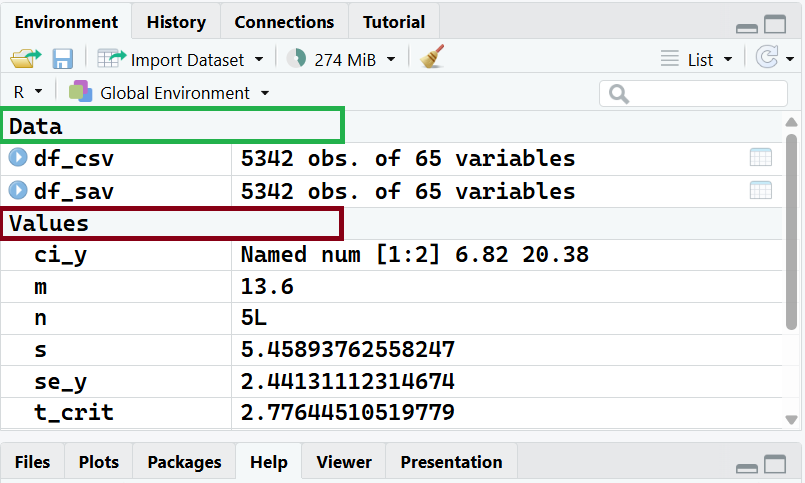{width=100% style="border: 2px solid darkblue;"}

Wir sehen, dass **RStudio** direkt zwischen <span style="color: darkred; font-weight: bold;">Values (einzelne Werte)</span> und <span style="color: green; font-weight: bold;">Data (Datensätze, Tabellen und andere Objekte)</span> unterscheiden kann.

___

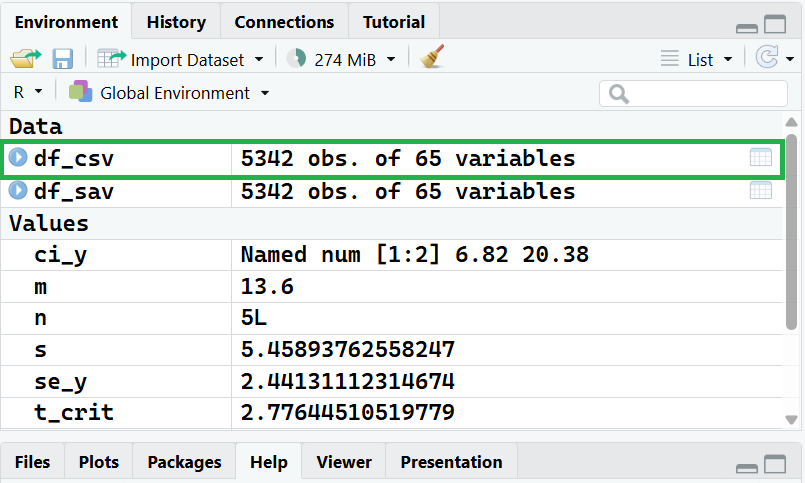{width=100% style="border: 2px solid darkblue;"}

Schauen wir uns unser Datensatz-Objekt genauer an. <span style="color: green; font-weight: bold;">Klicke</span> einfach auf `df_csv` – neben deinem Skript sollte sich nun der Datensatz öffnen.

___

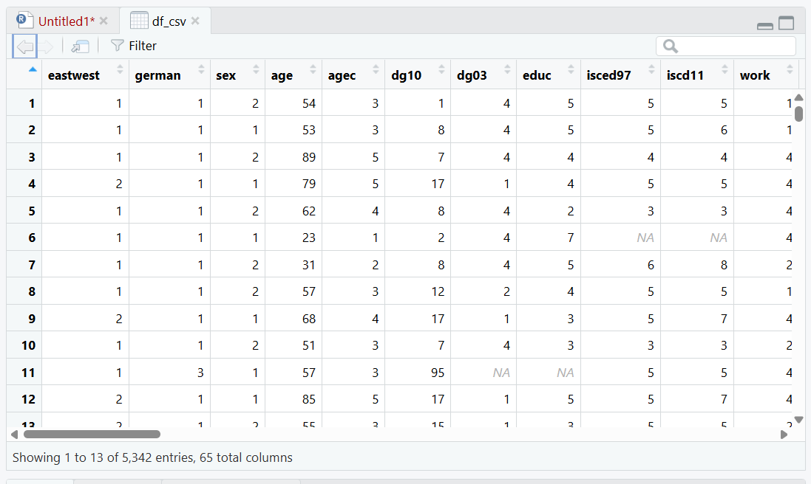{width=100% style="border: 2px solid darkblue;"}

Mit **`View(df_csv)`** kämen wir zum selben Ergebnis. Jetzt kannst du den Datensatz im Detail anschauen.

___

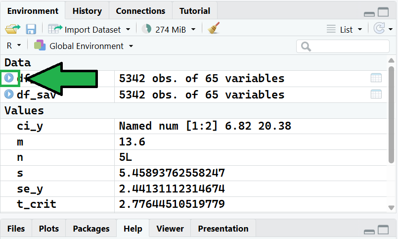{width=100% style="border: 2px solid darkblue;"}

Zurück zum Environment! Mit einem <span style="color: green; font-weight: bold;">Klick</span> auf den blauen Pfeil neben dem Objektnamen öffnest du ein Dropdown mit mehr Informationen – Struktur und Inhalte des Objekts.

___

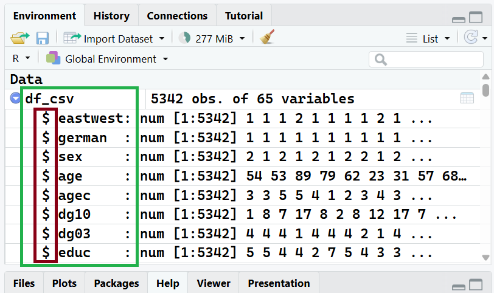{width=100% style="border: 2px solid darkblue;"}

Wir sehen einen logischen Aufbau: <span style="color: green; font-weight: bold;">der Objektname als übergeordnete Struktur</span> und die Variablen als untergeordnete Ebene. Getrennt werden diese zwei Ebenen durch das **`$`**.

___

Der Zugriff auf eine Variable folgt dieser Logik:

1. Erst den Objektnamen eintippen → **`df_csv`**
2. Dann die untere Ebene „aufmachen" → **`$`**
3. Dann den **Variablennamen** eintippen → **`age`**

```{r}
#| echo: true
#| eval: false

df_csv$age
```

Im Output sollten nun alle Altersangaben der teilnehmenden Personen als Vektor erscheinen.


## Übung

Berechne das **Durchschnittsalter** (Mean) und die **Standardabweichung** (SD) des Alters.

::: {.callout-tip collapse="true"}
# **Lösung**

::: {.panel-tabset}

# Alternative 1

```{r}
#| echo: true

mean(df_csv$age, na.rm = TRUE)
sd(df_csv$age, na.rm = TRUE)
```

# Alternative 2

```{r}
#| echo: true
#| warning: false

library(psych)
describe(df_csv$age)
```
:::

:::


### Einführung dplyr
___
`dplyr` ist Teil des **`tidyverse`** und bietet Funktionen,  
mit denen sich Datensätze **lesbar, konsistent und effizient** bearbeiten lassen.

Der Fokus liegt auf:
- klarer, gut nachvollziehbarer Syntax  
- schrittweisem Arbeiten  
- einer einheitlichen „Grammatik" für Datenmanipulation

::: callout-important
# Wichtigste Funktionen

- `select()` – Variablen auswählen  
- `filter()` – Fälle auswählen  
- `mutate()` – neue Variablen erstellen  
- `arrange()` – sortieren  
- `rename()` – Variablen umbenennen
:::

Bevor wir mehrere Schritte kombinieren, schauen wir uns ein **einzelnes, einfaches Beispiel** an:

```{r}
#| echo: true

select(df_csv, age, sex)
```

`select()` wählt Variablen aus und gibt einen neuen Datensatz zurück (`tibble` fungiert dabei genauso wie ein Data Frame).

::: callout-caution
# **Achtung**

Ohne eine **Zuweisung** wird **kein neues Objekt** erstellt!

```{r}
#| echo: true

df_2var <- select(df_csv, age, sex)
df_2var
```
:::

Die Datenaufbereitung besteht meistens aus **mehreren Schritten:**

- Variablen auswählen
- Fälle filtern
- neue Variablen erstellen
- Variablen umbenennen

Wir wählen nun unsere Variablen aus und filtern gleichzeitig: Wir wollen alle Personen **ab 30 Jahren** behalten.

:::{.panel-tabset}

# Alternative 1
```{r}
#| echo: true

df_2var <- select(df_csv, age, sex)
df_2var
```

# Alternative 2
```{r}
#| echo: true

df_2var <- filter(select(df_csv, age, sex), age >= 30)
df_2var
```
:::

**Alternative 2** wirkt auf den ersten Blick effizienter, ist aber schwieriger zu lesen – besonders wenn viele Schritte folgen.

Auch dafür gibt es in R eine elegante Lösung: **Pipes**.

## Pipes

Pipes in R sind ein Operator (`%>%` oder `|>`), mit dem das Ergebnis **eines Schritts direkt** an den **nächsten Befehl weitergereicht** wird, ohne Zwischenergebnisse extra zu speichern. Dadurch lassen sich **Datenverarbeitungsschritte** wie in einer Kette lesen – der Code wird kürzer und übersichtlicher.

Man kann sich Pipes vorstellen wie die Röhren aus Super Mario:

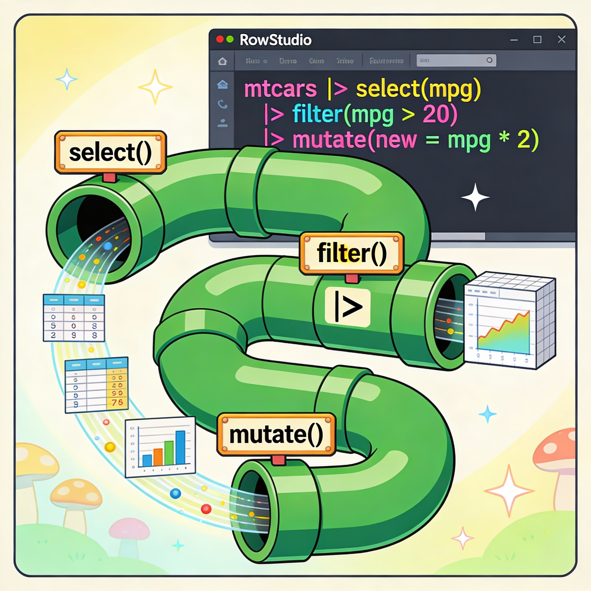{width=100% style="border: 2px solid darkblue;"}

```{r}
#| echo: true

df_2var <- df_csv |>
  select(age, sex) |>
  filter(age >= 30)

df_2var
```

Die Struktur ist klar und wir müssen den Befehlen innerhalb der **Pipe** nicht ständig erklären, welchen Datensatz wir heranziehen.

## Übung

1. Erstelle zunächst eine neue Variable `soz.u` aus den Variablen `im17` bis `im21` → bilde dafür einen **Summenwert**
2. Erstelle einen neuen Datensatz `df_analyse` mit den Variablen **Alter, Geschlecht, Bildung, Berufstätigkeit und Soziale Ungleichheit**
3. Filtere nur die Personen, die **weiblich** angegeben haben, in einen neuen Datensatz `df_analyse_w`

::: callout-note
# **Tipp**
- Nutze das **Codebuch!**
- Erinnere dich an die wichtigsten Funktionen von `dplyr`
- Verwende **Pipes**, wenn du sie brauchst

Das Wichtigste: **Learning by doing!**
:::


::: {.callout-tip collapse="true"}
# **Lösung**

:::{.panel-tabset}
# Alternative 1

```{r}
#| echo: true

# Aufgabe 1
df_csv <- df_csv |>
  mutate(soz.u = im17 + im18 + im19 + im20 + im21)

head(df_csv$soz.u, 10)

# Aufgabe 2
df_analyse <- df_csv |>
  select(age, sex, educ, work, soz.u)

head(df_analyse, 10)

# Aufgabe 3
df_analyse_w <- df_analyse |>
  filter(sex == 2)

head(df_analyse_w, 10)
```

# Alternative 2

```{r}
#| echo: true

df_analyse <- df_csv |>
  mutate(soz.u = im17 + im18 + im19 + im20 + im21) |>
  select(age, sex, educ, work, soz.u)

head(df_analyse, 10)

df_analyse_w <- df_analyse |>
  filter(sex == 2)

head(df_analyse_w, 10)
```

:::
::: 

# Abschluss Tag 1
___
Heute hast du die Grundlagen gelegt, um sicher mit RStudio zu arbeiten:

- RStudio-Oberfläche und Projekte kennengelernt  
- erste Objekte und Vektoren erstellt  
- Datentypen und Datenstrukturen verstanden  
- einen Datensatz importiert und plausibilisiert  
- erste Schritte der Datenaufbereitung mit **dplyr** und **Pipes** gemacht  

::: callout-tip
## Ausblick auf Tag 2

Morgen bauen wir auf diesen Grundlagen auf und gehen einen Schritt weiter in Richtung „echter Analyse-Workflow":

- **Recap** (kurzer Rückblick & Fragen)
- **Umkodieren** (neue Kategorien, Skalen, Re-Codes)
- **Joins** (Datensätze zusammenführen) 
- **Fehlende Werte** (NA erkennen, zählen, behandeln)  
- **Workflows** (Ordnerstruktur, Skripte, Output)  
- **Mini-Projekt** (alles zusammen anwenden)  
:::

👉 **Speichere dein Projekt**, damit du morgen direkt weiterarbeiten kannst.

___
[➡️ Weiter zu Tag 2](day2.qmd){.btn .btn-primary}
